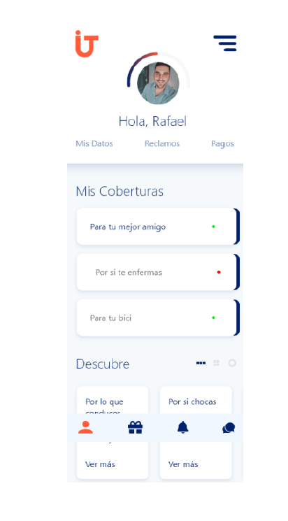
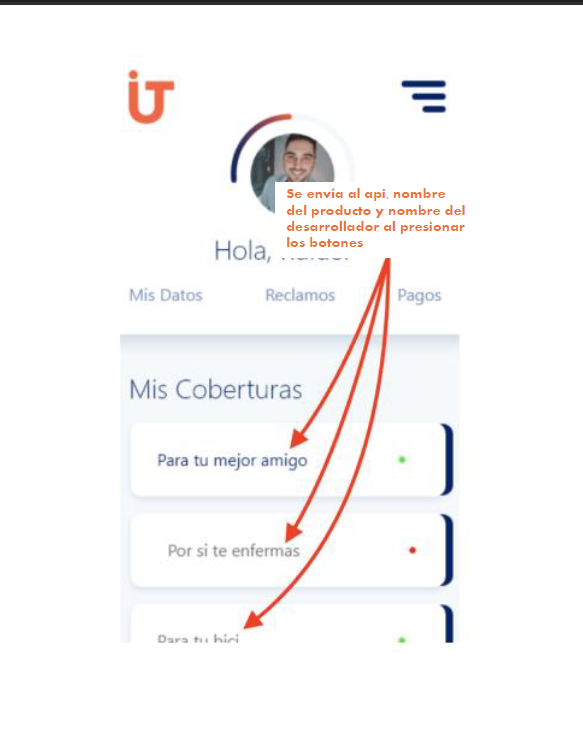

# Angular Test

Este es una prueba técnica a desarrollar en **Angular** y un API en **Node.js** con **Express** que recibe información de productos y sus desarrolladores mediante una solicitud `POST`.


## 📝 Pasos Iniciales

Antes de continuar con la configuración de la API, asegúrate de completar los siguientes pasos:

1. **Construcción en Angular 17-19**: Se debe desarrollar la interfaz suministrada utilizando Angular en la versión 17-19.
2. **Fidelidad al diseño**: La interfaz debe coincidir con el diseño proporcionado.
3. **Diseño responsive para desktop y tablets**: La interfaz debe ser adaptable a las diferentes pantallas. 
4. **Funcionalidad de botones y alertas**: Los botones deben desactivarse y activarse dependiendo si el endpoint responde de manera satisfactoria o no.



3. **Consumo del servicio desde el backend local**: La aplicación frontend debe realizar solicitudes `POST` a la API.

### 📍 Consumo del Servicio

Para los botones en la sección **Mis Coberturas**, al dar clic se debe realizar una solicitud `POST` a la siguiente ruta:

**URL:** `http://localhost:3000/api/product`



Se envía al API: 
- Nombre del producto y nombre del desarrollador al presionar los botones.

**Método:** `POST`

**Datos enviados al API:**
```
{
  "productName": "Nombre del Producto",
  "developerName": "Nombre del Desarrollador"
}
```
# Respuesta esperada:
```
{
  "message": "Producto recibido correctamente",
  "data": {
    "productName": "Nombre del Producto",
    "developerName": "Nombre del Desarrollador"
  }
}
```

# 🚀 Instalación y Configuración

# 📌 Clonar el repositorio

```
git clone https://github.com/tuusuario/node-api-test.git
cd node-api-test
```

# 📌 Instalar dependencias

```
npm install
```
# 📌 Ejecutar el servidor

Modo normal:

```
npm start
```

Modo desarrollo (con nodemon):

```
npm run dev
```

# 📌 Uso del API
📍 Endpoint disponible
POST /api/product → Recibe los datos del producto.
📍 Ejemplo de solicitud
URL: http://localhost:3000/api/product

Método: POST

Headers:

```
{
  "Content-Type": "application/json"
}
```
Cuerpo (Body - JSON):

```
{
  "productName": "Aplicación Demo",
  "developerName": "Juan Pérez"
}
```

📍 Respuesta esperada

```
{
  "message": "Producto recibido correctamente",
  "data": {
    "productName": "Aplicación Demo",
    "developerName": "Juan Pérez"
  }
}
```

# 🛠 Tecnologías a utilizar
- Angular
- Node.js
- Express


# 📌 Estructura del Proyecto

```
node-api-test/
│── assets/              # Imagénes de diseño
│── node_modules/        # Módulos instalados por npm
│── src/
│   ├── controllers/     # Controladores que manejan la lógica de negocio
│   │   ├── productController.js
│   ├── routes/          # Definición de rutas
│   │   ├── productRoutes.js
│   ├── config/          # Configuración global
│   │   ├── serverConfig.js
│   ├── app.js           # Configuración de la app
│── .gitattributes       # git attributes
│── .gitignore           # Archivos a ignorar en Git
│── package-lock.json    # Archivo de configuración
│── package.json         # Archivo de configuración de npm
│── README.md            # Documentación del proyecto
│── server.js            # Archivo principal para iniciar el servidor
```

# 🎙 Explicación en Vivo

Después de completar los pasos anteriores, se recomienda realizar una explicación en vivo del código. En esta sección, el desarrollador debe describir:

- Desarrollo del ejercicio
- Cómo se manejan las solicitudes POST.
- Cómo se comunica la API con el frontend.
